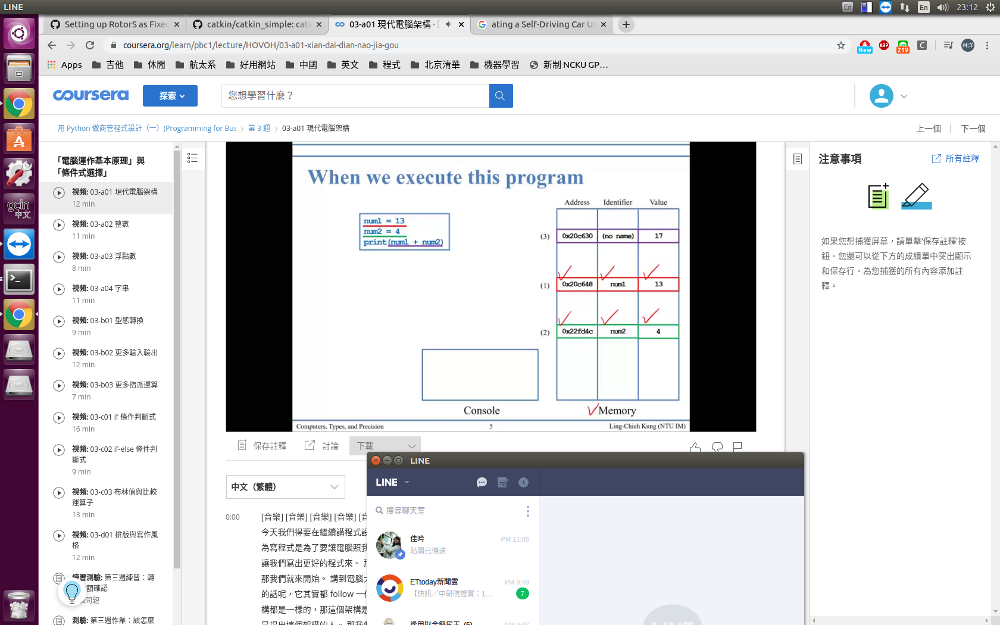
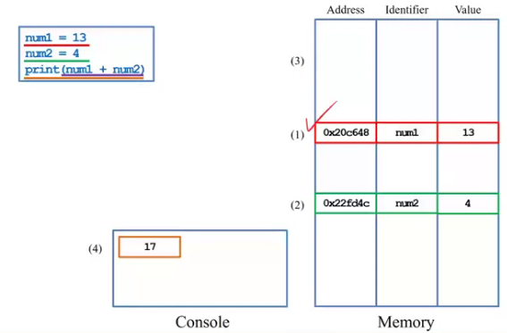

## Computer
* input: keyboards, mice, touch screen, microphones
* output: screen, speakers, printers
* storage: hard disk, CDs, DVDs, flash drive
* CPU & Memory:
    - CPU is where arithmetic operations are done
    - Memory is a volatile-storage(暫存記憶體，關機後就歸零) space

 

## Program
a program is a file containing source codes
- it is stored in 'storage'

when we execute/run a program
- we create **variables** in 'memory' to store **values**
- we move values into 'CPU' for **arithmetic operations**, and then move the results back to 'memory'.
- 每一次程式要跑的時候
    - 去 storage 把 program 拿出來
    - 接受 input
    - 在 CPU 及 memory 兩者間反覆移動來計算
    - 最後輸出結果 output

we may do more:
- read from 'input' and write to 'output'
- read from 'storage' and write to 'storage'

 

## Variables and values
when we declare a **variable**, the operating system(OS) allocates a space in memory for that variable(去記憶體裡面去找一塊空間來儲存變數)
- later **values** can be stored there
- that value can be read, written, and overwritten

the OS records four things for each variable:
- address
- name (identifier)
- value
- type

-------------------------------

## Type

