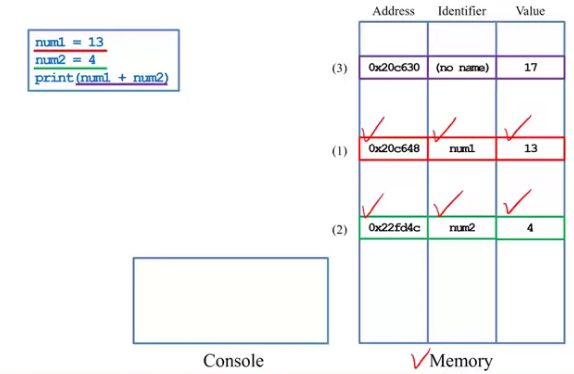

## Computer
* input: keyboards, mice, touch screen, microphones
* output: screen, speakers, printers
* storage: hard disk, CDs, DVDs, flash drive
* CPU & Memory:
    - CPU is where arithmetic operations are done
    - Memory is a volatile-storage(暫存記憶體，關機後就歸零) space

<br>

## Program
a program is a file containing source codes
- it is stored in 'storage'

when we execute/run a program
- we create **variables** in 'memory' to store **values**
- we move values into 'CPU' for **arithmetic operations**, and then move the results back to 'memory'.
- 每一次程式要跑的時候
    - 去 storage 把 program 拿出來
    - 接受 input
    - 在 CPU 及 memory 兩者間反覆移動來計算
    - 最後輸出結果 output

we may do more:
- read from 'input' and write to 'output'
- read from 'storage' and write to 'storage'

<br>

## Variables and values
when we declare a **variable**, the operating system(OS) allocates a space in memory for that variable(去記憶體裡面去找一塊空間來儲存變數)
- later **values** can be stored there
- that value can be read, written, and overwritten

the OS records four things for each variable:
- address
- name (identifier)
- value
- type




-------------------------------

## Type

a variable's type is **automatically** determined by Python according to the type of the initial value(在 python，只要給訂初值，就決定了變數的 type)
- 且在 python 當中，variable 的 type 是可以改變的

### Integers
* a computer stores values in a **binary system**
* today common lengths of an integer are 16 bits, 32 bits, 64 bits, 96 bits...(1 byte = 8 bits)

### Signed integers
* integers may be positive, zero or negative
* to represent negative numbers, we use the **first bit** to denote the **sign**
* 

### Integers in Python
* integers in Python are default signed, they can represent negative values

``` python
i = 52
print(i)
print(type(i))
```
``` python
i = int()
print(i)     ## default = 0
print(type(i))
```

---------------------------

## Floating-point numbers
* to represent **fractional numbers**, most computers use **floating-point numbers**
* moreover, the 'binary point' may 'float' to make the mapping flexible
    - to represent more values or increase precision
    - this is why a fractional number is called a floating-point number
* 

### Floating-point numbers in Python
* a floating-point number in Python are by default signed

``` python
i = 52.0
print(i)
print(type(i))
```

### Memory allocation
* when we declare a variable, its type matters
    * the OS understands its value based on its type
    * an integer and a floating-point number represent **different values** even if they store the same sequence of bits
* 
* this is why each variable needs to have a **type**

-------------------------

## Characters
* a computer cannot store **characters** directly
* it presents characters by encoding each character into an integer
* IN MOST pcS, we use the **ASCII code**
    * ASCII = American Standard Code for Information Interchange
    * it use **one byte**(-128 to 127) to represent English letters, numbers, symbols, and special characters
    * ex: '0' = 48, 'A' = 65, 'a' = 97
    * it does not represent ex: Chinese characters

``` python
c = 52
cAsChr = chr(c)
print(cAsChr)
```
- an integer c is created and assigned 52
- the corresponding character '4' in the ASCII table is printed out
- c is an integer(int), but cAsChr is a character(chr)

- a **string** is a sequence of character
- in fact, even a single character is consigered a string(of length 1) in python

### String operation in Python
- the function `len()` return the **length** of a string
- strings are **concatenated** by the string concatenation operation (+)

### Non-English characters and symbols
- to represent Chinese characters, we need other encoding standards(UTF-8, Big-5...)
- Special symbols (like 、, ~, ...) also need to be encoded
    - English characters and symbols are all **halfwidth**
    - all **fullwidth** symbols are non-English symbols
- 許多時候網站打開是亂碼，因為用了錯誤的編碼表來處理

------------------

## Casting
- we may convert a value from one type to another type
    - type conversion is called **casting**
- to cast a float or string to an integer, use `int()`
- what will happen if we try to cast 52.6 or "52 is great" to an integer
    - 52.6 -> int() -> 52(type=int)
    - '52 is ehf' -> int() -> ValueError
- to cast an integer or string to a float, use `float()`
- to cast an integer or a float to a string, use `str()`

## More about input
- the function `input()` reads a user input from the keyboard(typically)
- whatever the user types, `input()` read it **as a string** (Python input 進去的資料都是 string, 記得做轉換)
    - sometimes we need to cast the input by ourselves
- the function `print()` prints whatever behind it
    - those things are actually converted to strings before being printed
- as strings can be **concatenated**, we may but multiple pieces of variables/values(sometimes called 'token') behind a `print()` to print all of them
    - to do the separation, use the comma operator (,)
``` python
num1 = int(input())
num2 = int(input())
print("the sum is", num1 + num2)
```
- the second item `num1 + num2` is first **cast to a string**
- Python **automatically** insert a white space between two neighboring items

<br>

- there are many way in Python to remove the white spaces
- the easiest way is to **concatenate** those items into a string **manually**(using +)
``` python
income = int(input())
print("my income is $" + str(income))
```
- we need to first **cast** income **into a string** by `str()` to avoid a run-time error

## Assignment
- when we put a variable at the left of an **assignment operatoe** (=), we assign the right-hand-side(RHS) value to it
- a statement like `a = a + 2` is a **self-assignment** operation( a variable is modified according to its own value)
- self-assignment operators: 
    - a += 2 (a = a + 2)
    - a -= 2 (a = a - 2)
    - etc
## Cascade assignment
``` python
a = b = 10
a = a + 2
print(a)
print(b)
```
----------------------

## Boolean data type
- there are only two possible values: `true` and `false`
- a Boolean variable is also called a binary variable
- Boolean variables can be created by `bool()`
- `bool()`的預設值是 False, False mean **0**

------------------------

## Formatting a program
- maintaining the program in a good **format** is very helpful
- there are some general guidelines for Python
    - add proper white spaces and empty lines
    - give variables understandable names
    - write comments


