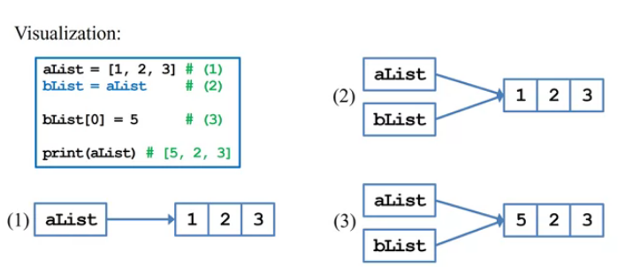
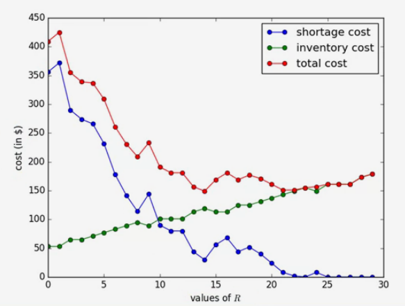
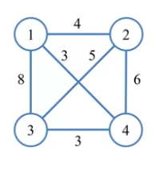

## Reading many values in a line
- in many cases we need to read a lot of values into our program
- an easy way to express an input is:
    - values will be **put in a line, separated by** white space(or commas or other **delimiters**)
    - for example, five student grades may be put in these ways:
    
    1. `98 65 57 48 80` 
    
    2. `98, 65, 57, 48, 80`
- one type of plan-text file, **CSV(comma-separated values)**, uses commas to separate each row into multiple columns
    - this is why it can be opened by MS Excel (or something similar)
- how to read this datas into your program

<br>

## Reading many values as a string
- Python is very good at string processing
- to read in a line of data, simply invoke `input()`
```python
gradeStr = input()
print(gradeStr)
```
- but gradeStr is a **string**, not five numbers!!!!
- we need to do three things:
    - **Splitting** the string into five pieces(substrings)
    - converting the five substrings into five numbers
    - put the five numbers into a **list**

<br>

## String splitting
- a string can be split by invoking `split()`
```python
gradeStr = input()   ## 1 2 3 4 5
grades = gradeStr.split()
print(grades)        ## ['1', '2', '3', '4', '5']
```

- we may choose the delimiter when invoking `split()`
```python
gradeStr = input()   ## 1, 2, 3, 4, 5
grades = gradeStr.split(',')
print(grades)        ## ['1', '2', '3', '4', '5']
```

- what is `grades`

<br>

## List

the outcome of invoking `split()` is a list

- a list is an **ordered container** that stores items
- an itemmay be an integer, a float, a string, or of other types
- Each item can be accessed by the **indexing operator []**
- the first item is indexed at **0**
```python
gradeStr = input()   ## 1 2 3 4 5
grades = gradeStr.split()
print(grades[0], grades[2] * 2)  ## 0 33
```

- the length of a list can be optained by invoking `len()`

-----------------

## List declaration
- we may **declare an empty list** as follows:
``` python
aList = []
print(aList, len(aList)) ## [] 0
```

- we may **declare a list of three 0s** as follows:
```python
aList = [0] * 3
print(aList, len(aList))  ## [0, 0, 0] 3
```

<br>

## Putting items into a list
- we may add into a list by invoking `append()`
```python
gradeStr = input()   ## 1, 2, 3, 4, 5
grades = gradeStr.split(',')
grades.append(-1)
print(grades)        ## ['1', '2', '3', '4', '5', '-1']
```
- note that the last item is an integer, not a string

<br>

## Traversing a list in a loop
```python
gradeStr = input()   ## 1 2 3 4 5
gradeList = gradeStr.split()
print(gradeList)     ## ['1', '2', '3', '4', '5']
grades = []

for g in gradeList:
    grades.append(int(g))

print(grades)        ## [1, 2, 3, 4, 5]
```

## Tic-Tac-Toe
let write a program to detect the winner of a tic-tac-toe game

```python
game = [[1, 0, 1], [1, 1, 0], [0, 0, 1]]  ## 2-dim list

for i in range(3):
    if game[i][0] == game[i][1] and game[i][1] == game[i][2]:
        print("winner: ", game[i][0])
        break
```

--------------

## List operation

| Method | Meaning |
| ---    | ---     |
| `<list>.append(x)` | add element **x** to end of list|
|`<list>.sort()` | sort the list |
|`<list>.reverse()`|reverse the list|
|`<list>.index(x)`|return the index of first occur x|
|`<list>.insert(i, x)`|insert x into an index i|
|`<list>.count(x)`|return the number of occurrences of x index|
|`<list>.remove(x)`|deletes the first occurrences of x in list|
|`<list>.pop(x)`|delete the ith element of the list and returns its value|

<br>

## List copying
```python
aList = [1, 2, 3]
anotherList = aList

anotherList[0] = 5
print(aList)   ## [5, 2, 3]
```

- why `aList` is modified?
- in Python, a list variable is a 'reference' referring to a set of values
    - copying a list is just **copying the reference**, not those values
    - modifying the values through different references has the same effect



- 要避免這種事發生，要另外開一個空的list，然後用迴圈 aList 的 element append 到 bList

-------------------------------------

## Operation Management
**Operation Management**(OM) deal with 'operation'
- operation are activities inside a company
- it was **Production Management** at the beginning
- today it includes Server Management, Decision Analysis, Supply Chain Management


typically OM issue
- facility location
- production planning and scheduling
- inventory control
- logistics and transportation

we will solve some OM problem by writing computer programs 

<br>

## Algorithms
an algorithm is a **step-by-step** procedure for solving a problem
- for a given task, it precisely describes **what to do** at each moment to complete that task


as an example, suppose that I want to sort Poker cards on my habds:
- first put one card at the first position
- look at the second card. Leave it there if it is bigger than the first one; exchange it with the first one otherwise
- look at the third card and put it as the first, second, or third card to make the first three cards sorted
- ...
- for the ith card, "insert" it to a position that makes the first ith card sorted

in short, it is a **detailed description of actions** such that each action is doable

--------------------

## Scheduling: Makespan minimization

- there are m **machines** in a factory
- there are n **jobs** to be processed
- job j has a given **processing time** p_j:
    - for a machine to complete job j, it needs to spend p_j amount of time
    - we say job j is completed at its completion time `C_j` if `C_j = S_j + p_j`, where `S_j` is its start time(the time that it is started to be processed)
- a typical scheduling problem is to schedule these jobs to machines to **minimize the makespan**, i.e., the latest completion time among all jobs (最小化最晚完成的job的時間，就是讓整個任務完成的時間最小的意思)

### Example
- there are ten jobs with processing times 3, 3, 3, 4, 4, 5, 5, 6, 7, and 8
- there are three machines
- schedule 1: Makespan = 18 
    - |machine 1|machine 2|machine 3|
      |---------|---------|---------|
      |3|4|5|
      |3|4|5| 
      |3|7|8|
      |6|.|.|
- schedule 2: Makespan = 16
    - |machine 1|machine 2|machine 3|
      |---------|---------|---------|
      |3|4|5|
      |3|5|3| 
      |4|7|8|
      |6|.|.|

- makespan minimization is for **load balancing**
    - to fairly allocation jobs
    - to save utility fees
    - to go home as early as possible
- it turns out that this problem is 'hard'
    - most reasearcher believe that an optimal schedule is too time-consuming to obtain in general
- several **heuristic algorithms** have been developed 
    - typically easy to implement, easy to execute, and time-efficient
    - typically not too bad (near optimal)

## Longest processing time first (LPT)

one well-known algorithm for makespan minimization is the **longest processing time first(LPT)** rule
- first, **sort** jobs in the descending order of their processing times.(先排大的 job，小的挑空隙塞)
- then in each iteration schedule a job to the machine that is currently **the least loaded**(having the earliest completion time)(在每次疊代，將工作分給目前工作量最小的 machine)

we call LPT an **iterative algorithm**
- it runs in iterations
- in each iteration, it performs a similar action

we call LPT a **greedy algorithm**
- in each iteration, it makes the choice that is **the best at that moment**

in fact, even if we skip the sorting step, the algorithm still perform 'well'

<br>

## LPT implementation (without sorting)
- let's implement LPT without the sorting step
- first, read inputs and do the preparations:
```python
# read and prepare n, m, and p
n = int(input("Number of jobs: "))
m = int(input("Number of machines: "))
pStr = input("Processing times: ")

p = pStr.split(' ')
for i in range(n):
    p[i] = int(p[i])

# machine completion times
loads = [0] * m
assignment = [0] * n
```
- second, we do iterative assignment:
```python
# in iteration j, assign job j to the least loaded machine 
for j in range(n):

    # find the least loaded machine
    leastLoadedMachine = 0
    leastLoad = loads[0]
    for i in range(1, m):
        if loads[i] < leastLoad:
            leastLoadedMachine = i
            leastLoad = loads[i]
    
    # schedule a job
    loads[leastLoadedMachine] += p[j]
    assignment[j] = leastLoadedMachine + 1

    # to check the process
    print(str(p[j]) + ": " + str(loads))
```
- finally, we check the result:
``` python
# the result
print("job assignment: " + str(assignment))
print("machine loads: " + str(loads))
```

### LPT 不能保證是最佳解(向這邊是可以排出 [15, 15, 15])

## Remarks
LPT has been shown to have a worst-case performance guarantee
- let z* be the makespan associated with an optimal solution
- let z^LPT be the makespan obtained by LPT
- for any instance, we have (z^LPT / z*) <= 4/3
- the approximation factor of LPT is 4/3

even if we do not sort jobs first, the approximation factor is 2

analysis is hard, but implementation (and problem solving) is easy

<br>
------------------------------

## Inventory control
**Inventory** are commonly needed in practice
- retailers keep inventory of products
- manufacturers keep inventory of raw materials

why inventory?
- to be a buffer between supply and demand
- to balance between fixed ordering cost and variable holding cost

to control inventory, people develop **inventory policies**
- when to order
- how many to order
- from whom to order(if there are multiple suppliers)

## Common inventory policies
a common inventory policy is **the (Q, R) policy**
- regularly check the amount of inventory level I
- if I < R, order Q units. Otherwise, do nothing

another common policy is **the (s, S) policy**
- regularly check the amount of inventory I
- if I < s, order up to S. Otherwise, do nothing

兩者只差在訂貨的行為有點不一樣

<br>

## Automatic ordering
- obviously, today people may implement **automatic ordering**
- if we build a **continuous** review system:
    - whenever one item is sold through the POS(point-of-sales) system, check the inventory level.(像是刷條碼時，每刷一次存貨量就少1)
    - if the reorder point is reached, place an order(若到達需要訂貨的量，就執行自動訂貨，每次答觸發條件就訂貨)

- if we build a **periodic** review system:
    - check the inventory level at the end of each 'period'(e.g., a day)(只要達條件就訂貨，供應商可能不堪其擾，所以一班都是每隔一段固定的時間才進貨)
    - if the reorder point is reached, place an order

## Implementation of the (Q, R) policy
- let's implement the (Q, R) policy:
```python
Q = int(input("order quantity Q: "))
R = int(input("reorder point R: "))
I = int(input("initial inventory I: "))
print("inventory: " + str(I))

while True:
    sales = int(input("sales in a day: "))
    I = I - sales if I - sales >= 0 else 0
    # 如果需求大於存貨量，歸零

    if I < R:
        I = I + Q
    print("inventory: " + str(I))
```

## Optimizing the (Q, R) policy
重點是怎麼決定Q與R

how to choose the policy parameters Q amd R?
- **Inventory cost**: cash generates investment returns, but inventory does not
- **Ordering cost**: the fixed cost incurred for each order (e.g., shipping cost)
- **Shortage cost**: the loss sales and goodwill upon shortage

objective: Minimize the sum of inventory, ordering, and shortage cost

suppose that your boss asks you to optimize the (Q,R) policy:
- Q is fixed to 30 due to a requirement set by the supplier
- the unit purchasing cost is $1000 and the annual interest rate is 7.3%
- the per order shipping cost paid to the supplier is $200
- if a customer comes but there is no on-hand inventory, she waits while getting $2 off
- daily demands for the past twenty days are given. Thirty units were on hand twenty days age

`14, 23, 26, 17, 17, 12, 24, 19, 10, 18, 22, 31, 19, 16, 22, 28, 20, 27, 20, 32`

- note that as Q is fixed, the ordering cost does not matter
- which R minimizes the total cost?

<br>
what if we have chosen R=10:

|day|1|2|3|4|5|6|...|
|---|---|---|---|---|---|---|---|
|sales|.|14|23|26|17|17| ...|
|before replenishment|20|6|13|-13|0|13|...|
|after replenishment|.|36|13|17|30|13|...|
|inventory cost|.|$7.2|$2.6|$3.4|$6|$2.6|...|
|shortage cost|.|$0|$0|$26|$0|$0|...|

- the total cost (for the past twenty days) with R=10 is $191
- is it good or bad?

## Finding the 'optimal' R
- to find R that minimizes the **expected total cost** for the future, we need to estimate/forecast/predict future demands
- a proxy is to find R that minimizes the total cost **for the past twenty days**
    - for each value of R = 0, 1, 2, 3,..., suppose that we have implemented the (Q,R) policy, what is the cost for the past twenty days?
    - if the demand pattern is going to remain **unchanged**, this should be good
    - this works only if we have past demand, not only past sales(擁有需求資訊可以更精準，像是sales=0不代表是不想買，可能是沒存貨導致顧客買不到)

## Implementation
- first, we get the given information ready:
```python
# past sales
salesStr = "14, 23, 26, 17, 17, 12, 24, 19, 10, 18, 22, 31, 19, 16, 22, 28, 20, 27, 20, 32"
sales = salesStr.split(',')
for i in range(len(sales)):
    sales[i] = int(sales[i])

# given information
stgCost = 2
invCost = 1000 * 0.073 / 365  # 東西沒賣出去，放在庫房的折舊
Q = 30
I = 20
```

- we then search for the best R and print it out
```python
# finding the best R
bestR = 0
costOfBestR = 100000000
for R in range(Q):
    totalCost = 0

    # finding the total cost of this R
    for s in sales:
        I -= s
        if I < 0:
            totalCost += -I * stgCost
            I += Q 
        elif I < R:
            I += Q 
        totalCost += I * invCost

    # update bestR when necessary
    if totalCost < costOfBestR:
        bestR = R
        costOfBestR = totalCost
    pr(R, totalStgCost, totalInvCost, totalCost)
print(bestR)
```



## Further questions
- what if we also want to optimize Q
- what if we have multiple products with independent ordering operations?
- what if we have multiple products, and it is preferred to combine their purchasing orders?
- what if sales are lost rather than backlogged?

----------------------------
<br>

## Logistics and transportation
物流與運輸
- logistics and transportation problems are common in supply chain management and service management
    - route, quantity, timing, and transportation mode selection
    - shipping goods among suppliers, manufacturers, and retailers
    - shipping goods to consumers
    - sending passengers here and there

- many of these problems are solved by **algorithm**
    - to save cost
    - to deliver better service
    - to increase profit

## travelling salesperson problem
in many cases, we need to deliver/collect items to/from customers in the most efficient way

e.g., consider a post officer who needs to deliver to three addresses
- the shortest path between any pair of two addresses can be obtained
- this is a **routing** problem: To choose a route starting from the office, passing each address exactly once, and then returning to the office

    

- this is a **sequencing** problem; in total there are 3! = 6 feasible routes(some are identical). which route minimizes the total distance (or travel time)?

## Vehicle routing problem
- sometimes the **vehicle capacity** is also an issue
- consider the truck towing bicycles in NTU
    - it must start at the car pound, pass several locations in NTU, and then return to the origin
    - however, the truck capacity is quite limited(because too many people violate the parking regulation)
    - the driver needs to find multiple routes to cover all the locations
- the traveling salesperson problem is a special case of vehicle routing problems
    -   the vehicle capacity is unlimited

## A greedy algorithm for TSP
let's consider **a greedy algorithm** for TSP
- at the origin, go to the next location that is **closest**
- at each location, go to the next location among all unvisited ones that is **closest** to the current location
- repeating this until we get back to the origin

in this example, we will travel in the route (1, 4, 3, 2, 1). the total distance is 15
- (1, 4, 3, 2, 1) is optimal for this instance
- does the greedy algorithm always find an optimal route?

## Implementation of the greedy algorithm
- let's implement the greedy algorithm
- first, we get the given data ready:
```python
# set up the distance matrix
numLoc = 5
dst = [[0, 9, 6, 7, 4],  # 2-dim list 
       [9, 0, 5, 9, 6],  # dis[i][j] is the 
       [6, 5, 0, 3, 1],  # distance between
       [7, 9, 3, 0, 4],  # locations i and j
       [4, 6, 1, 4, 0]]

# set up the origin
origin = 0
```

- second, we prepare two lists **tour** and **unvisited**
    - in each iteration, we move one location from **unvisited** and to **tour**

```python
# tour: a list that will contain the solution
# tourLen: the total distance of the solution
# unvisited: a list that contains those unvisited locations at any time

tour = [origin]
tourLen = 0
unvisited = []
for i in range(numLoc):
    unvisited.append(i)
unvisited.remove(origin)
```

- the algorithm consists of `numLoc - 1` iterations
- in each iteration, we check the distance between the current location and each unvisited location
    - to find the closest unvisited location
- we move to the next location to initiate the next iteration
```python
# the algorithm
cur = origin
for i in range(numLoc - 1):
    # find the next location to visit
    next = -1
    minDst = 999
    for j in unvisited:
        if dst[cur][j] < minDst:
            next = j
            minDst = dst[cur][j]
    
    # move "next" from unvisited to tour
    unvisited.remove(next)
    tour.append(next)
    tourLen += minDst

    # run the next iteration from the next location
    cur = next
```
- finally, we complete the tour and print out the solution
```python
# complete the tour
tour.append(origin)
tourLen += dst[cur][origin]

# print out the solution
print(tour, tourLen)
```

<br>

## Improving the input process
- our program should allow a user to input her/his instance information
```python
# set up the distance matrix
numLoc = int(input())
dst = []
for i in range(numLoc):
    dst.append(input().split())
    for j in range(numLoc):
        dst[i][j] = int(dst[i][j])

# set up the origin
origin = 0
```
- how to avoid entering a lot of numbers for each trial?
    - first, save your input in a plan text file. Give it a file name(e.g., 'TSP_in.txt')
    - open the console/terminal window to execute your program
    - use < (or something similar) like '**python TSP.py < TSP_in.txt**' to load the input data
 
 ## Remarks
 - many decisions may be supported by computers and programs
    - as long as we have a good **algorithm** and **know how to program**
- to solve real problems, we need **domain knownlodge**
    - being able to program allows one to **implement a solution** by herself/himself or collaborating with engineers
    - being able to program allows one to **try** some solutions
    - being able to program facilitates '**learning by doing**'
