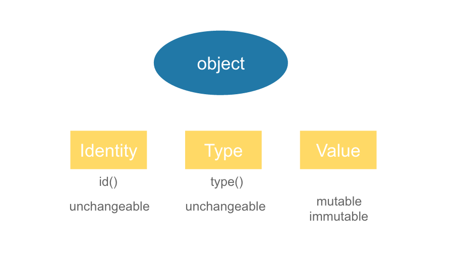

## Function
- a function is a named sequence of statements that performs a computation
- to use a function, you need to :
    - define the function
    - call the function by its name
    - you can pass input variables to the function

- python has many useful built-in functions
- the correct verb for using a function is 'call' or  'invoke'

<br>

## Arguments and Parameters
- when you define a function, you can allow the function to take input variables
- the **place** to receive input variables are **parameters**
```python
def n_duck(num):
    print("%s little duck went out one day" % num)
```
- `num` is a parameter that can receive input variables
- we assign the value of `num` by passing a `argument` to it. For example: `n_duck("Five")`
- `"Five"` is a argument (input value)
- the variable num will be assign with value "Five"

## And more..
- we can further define a new function that combines others functions

<br>

## What happens when you call a function
- at the point of calling, the original program suspended execution
- the parameters of the function are assigned to the values of argument
- execute the body of the function
- control return to the original point just after where the function was called

## Defining function
```python
def get_result(var1, var2):
    ''' compute final result(用來說明這function做什麼用)
    '''
    line1
    line2
    return total_counter
```

## Default arguments
- a function can have multiple parameters
- you can assign default values to some of there parameters
```python
def print_msg(item, ndays=30):
    print("please return %s in %d days" % (item, ndays))
```
- 這裡的 `ndays=30`，代表 default 值為30
- 若沒給特定的值，則 ndays 就是30 

## Calling with Parameter Names
- you can use parameter names when calling a function
- when parameter names are used, the order of arguments does net matter
- ex: 
    ```python
    print_msg(ndays=25, item='books')
    ```
- 這裡使用了變數名稱，所以不按照原本函數的變數輸入順序也不會有錯誤

<br>

## Scope of Variables and Parameters
- parameters and variables defined within a function are local(區域變數)
- local variables only exist **inside the function**
- variables defined on the **outer part of a py file** are called **global variable(全域變數)**. You can access the global variables within a function
- the only way for a function to see a variable from another function is for that variable to be passed as a parameter.

## Local and Global variable
- consider the scenario that we are creating a function named `given_total` that compute the total amount due for a product
- `given_total` takes only one input, n, which is the number of product purchased
- assume that the unit price of the product is $1.2
```python
def given_total(n):
    unitp = 1.2
    total = unitp * n
    return total
```

- we cannot access `unitp` outsize of the function
- because: unitp is a local variable that live inside the `given_total` function
- how about we define a blobal variable of the same name?
- can we overwrite the local unitp?
    - no, you cannot!
    ``` python
    >>> unitp = 5
    >>> given_total(1)
    [output]: 1.2
    ```
- 在函數外部定義的相同名稱的全域變數，到了函數內部仍會以函數內部的變數名稱的值來計算

- on the other hand, you can  have read only access of global inside a function
- assume that we have a global variable weekend that tell us whether today is weekend
```python
def given_total(n):
    print("weekend=%d" % weekend)
    unitp = 1.2
    total = unitp * n
    return total

weekend = True
m = given_total(5)
-----------------------------------------
[output]: weekend=1
```
- if you need to change the value of weekend inside a function, you need to use the `global` keyword to declare that this is a global variable
- otherwise, outside world will not see the changes
```python
# given_total, v2
def given_total(n):
    unitp = 1.2
    weekend = False
    print("new weekend=%d" % weekend)
    total = unitp * n
    return total

weekend = True
print("outside, before calling: weekend=%d" % weekend)
m1 = given_total(5)
print("outside: weekend=%d" % weekend)
---------------------------------------------
[output]: outside, before calling: weekend=1
          new weekend=0
          outside: weekend=1
```

### Example: the 'global' keyword
```python
def given_total(n):
    global weekend
    print("new weekend=%d" % weekend)
    unitp = 1.2
    weekend = False
    print("new weekend=%d" % weekend)
    total = unitp * n
    return total
----------------------------------------------
>>> weekend = True
>>> m1=given_total(5)
weekend=1
new weekend=0

>>>print("weekend (outside)=%d" % weekend)
weekend (outside)=0
```

## Return values of function
- function can provide output variables to its caller
- act just like functions in mathematics
- you can 'chain' the output to the input
- when `return` are reached, Python leaves the function and gives the control back to the caller of the function
- moreover, Python sends back the values provided in the `return` statement as the execution results

<br>

## Return many values
- compute the minimum and maximum of four input variables
```python
def min_max(x1, x2, x3, x4):
    r1 = min(x1, x2, x3, x4)
    r2 = max(x1, x2, x3, x4)
    return r1, r2
```
```python
out1, out2 = min_max(a1, a2, a3, a4)
print("min = ", out1)
print("max = ", out2)
```

## Debugging
- in cmd, use this:
    
    `python3 -u -i "your_program.py"`

## Function return values
- Question: what will happen if your function does not have the `return` keyword
- answer: Python will still execute your function until the end
- all Python functions return a value
- if you did not provide the return value, Python will hand back a sepcial object, denoted `None`
- a common bug is writing a value-returning function and omitting the return!
```python
def myabs(x):
    if x < 0:
        return -x
    if x > 0:
        return x

print(myabs(-3.5))
print(myabs(0))  # 沒定義到 x=0，這邊會傳回 None
```

<br>

## Arguments and Return values
- we use return values to send information back to the caller of a function
- Q: can we send back information using arguments(the input of function)?
    - it depends
- different programming languages have different designs
- some languages such as C or C++ can use the so call '**Call by Reference**' approach to send back information using arguments
- another approach is '**Call by Value**'
    - make copies of all input arguments before passing them into a function

## Python's Call by Assignment
- the detailed mechanisms are too complicated for beginners
- we will focus on the consequence of this design
- simply out, it depends on whether the argument is **immutable or mutable**
- first, we need to know that there are two types of objects in Python: immutable and mutable
- example of **immutable** objects: string, int, float
    - also: decimal, complex, bool, tuple, range, frozenset, bytes
- example of **mutuable** objects: list
    - also: dict, set, bytearray, user-defined class

## Mutable and Immutable Objects
- lists are mutable, meaning they can be change. string can **not** be changed
```python
>>> myList = [34, 26, 15, 10]
>>> myList[2]
15

>>> myList[2] = 0
>>> myList
[34, 15, 0, 10]

>>> myString = 'Hello world'
>>> myString[2]
'1'

>>> myString[2] = 'p'

Traceback (most recnet call last):
    File "<pyshell#16>", line 1, in -toplevel-
        myString[2] = 'p'
TypeError: object doesn't support item assignment
```
- immutable: 不能直接去更改原本物件內的內容
- 但若: `myString = new1`是可以的，因為這邊等於產生新的物件，且內容是`new1` (想成 `myString` 原本指向 `hello world`，後來指向 `new1`)

## Passing in Immutable Objects
- outside world cannot see changes made to immutable objects inside the function
    - similar to 'call by value'

```python
def swap1(x1, x2):
    tmp = x1
    x1 = x2
    x2 = tmp
    print("inside swap1: x1=", x1, "x2=", x2)

x1, x2 = 100, 5
print("outside: x1=", x1, "x2=", x2)
swap1(x1, x2)
print("outside: x1=", x1, "x2=", x2)
```
```python
[output]: outside: x1= 100 x2= 5
          inside swap1: x1= 5 x2= 100
          outside: x1= 100 x2= 5
```
- 函數內部的操作並不影響外部的變數值

<br>

## Passing in Mutable Object
- outside world can see changes made to mutable objects inside the function
    - similar to 'call by reference'
```python
def swap2(xlist):
    tmp = xlist[0]
    xlist[0] = xlist[1]
    xlist[1] = tmp
    print("inside swap2: xlist=", xlist)

xlist = [100, 5]
print("outside: xlist=", xlist)
swap2(xlist)
print("outside: xlist=", xlist)
```
```python
[output]: outside: xlist= [100, 5]
          inside swap2: xlist= [5, 100]
          outside: xlist= [5, 100]
```
- call by reference: 傳進去的是儲存數值的位址，對變數做操作時是對記憶體內存放的東西

## Recursion for factorial function
in mathematics, the factorial of a non-negative integer n, denoted by n!, is the product of all positive integers less than or equal to n.
- for example, 5! = 5*4*3*2*1 = 120

factorial can be defined recursively:
- 0! = 1
- n! = n * (n-1)!

Now, how do we create our own factorial function?
```python
def factorial(n):
    if n == 0:
        return 1
    else:
        recurse = factorial(n-1)
        result = n * recurse
        return result
```
when we run 'factorial(3)'
- since 3 is not 0, call factorial(2)
- in factorial(2): since 2 is not 0, call factorial(1)
- in factorial(1): since 1 is not 0, call factorial(0)
- in factorial(0): return 0

<br>

## Handling illegal inputs
what will happen if we call factorial(1.5)?
- rentimeError: maximum recursion depth execeded in cmp
- why? Because we encounter an infinite recursion because n will never be 0
- need to check for valid input -> create guardian(門神)
```python
if not isinstance(n, int):
    print("factorial is only defined for integers.")
    return None
```

<br>

## Debugging
- it is common to encounter problems when developing your program
- using functions allow you to focus on a few functions that are causing problems
- common possible causes:
    - the input is wrong. Invalid arguments
    - the logic of the function is wrong
    - the output of the function is used in the wrong way
- how do we pin down the causes?
    - print out status
    - also used extensively when developing new programs
    - **Scaffolding** -> remove these redundant print command afterward
    - using built-in debugging function(pdb)

## 補充
### Python 中的 Mutable & Immutable

在Python當中，一切皆對象，每個對象包含一個 idendity、type、value



- idendity: object的內存空間地址，其值可以用`id()`來獲取，一旦 object 被創建，其 idendity 將不可改變
-  type: object 的類型，其值可以由 `type()` 來獲取，一旦 object 被創建，其 type也不可改變
- value: object 的值
    - 有些可以改變 -> mutable object
    - 有些不可改變 -> immutable object

常見的 immutable object:
- numeric types: int, float, complex
- string
- touple
- frozen set

常見的 mutable objects:
- list
- dict
- set
- byte array
#### case 1
```python
>>> a = [1, 2, 3]
>>> id(a)
4317018016

>>> a[1] = 10
>>> id(a)
4317018016

>>> a
[1, 10, 3]

## a[1] = 10 執行後被改變，但其位址空間沒有改變
```
#### case 2
```python
>>> a = 1
>>> id(a)
139988111971072
>>> id(1)
139988111971072

>>> a = 2
>>> id(a)
139988111971104
>>> id(2)
139988111971104

## a = 2 的含意是創建一個值為 2 的 int 對象，再將 a 指向該地址，所以上例的 1 和 2 這兩個 int 對象的值並沒有改變，而是 a 這 variable 分別指向了 1 與 2
```
#### case 3
```python
>>> a = (1, 2, [3])
>>> id(a)
4317137728

>>> a[0] = 1
Traceback (most recent call last):
  File "<stdin>", line 1, in <module>
TypeError: 'tuple' object does not support item assignment

>>> a[2][0] = 100
>>> id(a)
4317137728

>>> a
(1, 2, [100])

## immutable 不能理解為絕對不可變，對於某些 container 類型的 object，如果它包含了一個 mutable 的 object，那麼 mutable object 的值是可變的。 因為 tuple 所含 list 改變的只是 value 而非 identity，所以 tuple 依舊被稱為immutable object
```


### Call by value & Call by reference
由 mutable 與 immutable 來了解 call-by-value 與 call-by-reference

- 重點是 assignment，每個 assignment 就會產生對於物件的一個參照，以下面的程式為例

- 再看到上面刻成的例子
### pass by value
```python
def swap1(x1, x2):
    tmp = x1
    x1 = x2
    x2 = tmp
    print("inside swap1: x1=", x1, "x2=", x2)

x1, x2 = 100, 5
print("outside: x1=", x1, "x2=", x2)
swap1(x1, x2)
print("outside: x1=", x1, "x2=", x2)
```
```python
[output]: outside: x1= 100 x2= 5
          inside swap1: x1= 5 x2= 100
          outside: x1= 100 x2= 5
```
- 由於傳入給 function `swap()` 的 `x1, x2` 是 **immutable**
- 所以函數內部的操作並不影響外部的變數值
- 想成在函數執行時，多一塊記憶體給函數使用
- 函數執行完後，記憶體釋出

<br>

### pass by reference
```python
def swap2(xlist):
    tmp = xlist[0]
    xlist[0] = xlist[1]
    xlist[1] = tmp
    print("inside swap2: xlist=", xlist)

xlist = [100, 5]
print("outside: xlist=", xlist)
swap2(xlist)
print("outside: xlist=", xlist)
```
```python
[output]: outside: xlist= [100, 5]
          inside swap2: xlist= [5, 100]
          outside: xlist= [5, 100]
```
- list 為 **mutable**
- 想成，傳進去函數的，是 `xlist` 的位址
- 因此，是直接在配給 `xlist` 的記憶體空間上做操作(append, ....)
- 而函數結束後，一樣 **pass by reference**，將修改後的 `xlist` 傳回來 