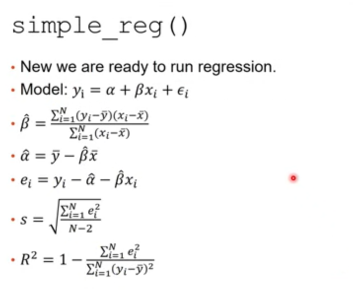
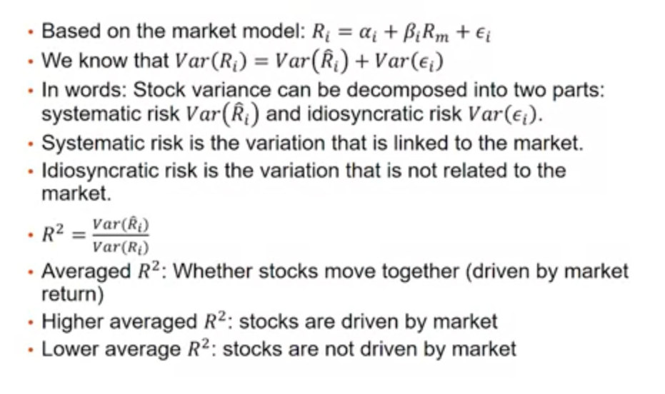
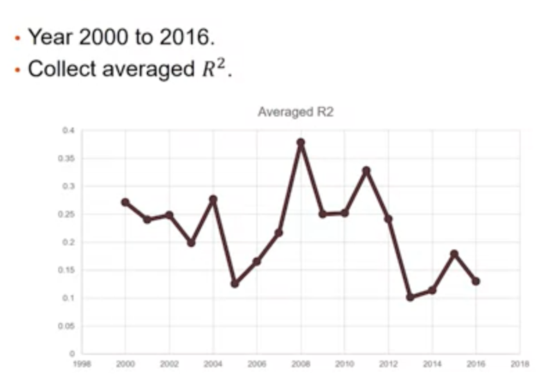

## 股票市場
股票市場分為初級市場與次級市場
- 初級市場: 又稱為**發行市場**，是指企業提供新的證券銷售給社會大眾的市場，又稱為**第一市場**
- 次級市場: 又稱為**流通市場**，是指社會大眾購買新證券之後，這些證券後續買賣的市場

我們平時看到的股價與交易資訊大多來自次級市場

### 交易所
台灣證券交易所股份有限公司(Taiwan Stock Exchange Corporation, TSEC)
- 成立於1961 10/3，1962 2/9 開業，為台灣證券集中市場
- 交易所為**股份有限公司**，為公司制

交易時間: 星期一至星期五每日 09:00~13:30
- 休假停市日除經特別公告外，與金融業的例行假日相同
- 台灣地區遇重大災害時，證券集中市場之休市市當地縣市首長宣布公教機關是否上班為準(例如颱風來襲，台北市若宣布停止上班，則台灣證券交易所休市)

## How do we Analyze Stock Return Data?
- we are going to adopt Capital Asset Pricing Model(CAPM) to analyze stock return data
- CAPM was invented by Jack Treynor, William F. Sharpe, John Lintner and Jan Mossin independently.
- Sharpe Markowitz and Merton Miller jointly received the 1990 Nobel Memorial Prize in Economics for this contribution to the field of financial economics.
- Standard textbook approach

## CAPM in Five Minutes
### assumptions
- investors are rational(理性的) and risk-averse(風險趨避: 今天有兩個選擇，1 直接拿十萬，2 擲硬幣，正面拿二十萬，反面沒錢。雖然兩種選擇的期望值相同，但第一種選項是風險趨避的)
- investors aim to maximize economic utilities(期望報酬)
- investors broadly diversified across a range of investments(不針對特定某一支股票進行買賣)
- investors are price takers(小戶、散戶)
- investors can lend and borrow unlimited amounts under the risk free rate of interest
- investors can trade without transaction or tasation costs
- all information is available at the same time to all investors
- all investors have homogeneous expectations

(以上為CAPM的一些基本假設，由這些假設可以導出基礎模型)

### Assumptions --> Maximize Expected Utility --> Pricing Model for Individual Stocks
- Pricing Model (linear): $R_i=R_f+\beta_i(R_m-R_f)+\epsilon_i$ 
- $R_i$: return of stock i
- $R_m$: market return
- $R_f$: risk free rate
- $\epsilon_i$: noise
- $\beta_i$(系統風險): 決定了這隻個股會隨大盤波動的幅度

### assume $R_f$ is a constant
- we have the following empirical model (Market Model)
- $R_i=\alpha_i+\beta_{i}R_m+\epsilon_i$
- $R_i$: return of stock i
- $R_m$: market return
- $\epsilon_i$: noise


meaning of $\alpha_i$ and $\beta_i$
- 因為是線性回歸模型，可以由模型估算出來
- $\alpha_i$: stock return when the market return is 0(市場報酬為零時，這支個股的期望報酬是多少)(用來衡量這支股票的體質，當市場報酬為零，還有正的報酬，代表體質好)
- $\beta_i$: security beta, systematic risk; the sensitivity of a stock to market return(市場報酬上升一個單位時，這隻個股的報酬上升多少。大於1代表變化比市場變化大，小於1代表變化比市場變化小)


<br>

## Data Analysis Steps
- running the model for every stock-year using daily returns
- Market return: need to download market return first(台灣股票加權指數報酬)
- stock return: download daily return of all stocks and compute regression model for each stock
- 資料來源: 台灣經濟新報
- 頻率: 日資料(使用除權息調整的資料)
- 包含股票: 所有普通股

## Issues
- the data is 'TAB' separated, not "comma" separated
- two head lines, one Chinese, one English
- data order is not suitable for our analysis
    - current order is by date, then by stock
    - a better way is to order by stock, then by date
- still need to have market return data
    -   need to "merge" market return with stock return by data


<br>

## Data Processing Steps
- preprocess: remove Chinese headline, convert to standard CSV file, remove all extra spaces
- sort data by stock and then by data
- prepare market return data
- for each stock:
    -   merge stock return with market data by date
    - run regression
    - record the result

### Preprocessing (Step 1)
- we need to read and write file
- we need to read and write CSV files

- the process of **opening** a file involves associating a file on disk with a variable.
- we can manipulate the file by manipulating this variable
    - read from the file
    - write to the file

#### File processing
- typical file manipulation routine:
    - file opened
    - read or write contents from/to the file
    - close the file
- when done with the file, it needs to be closed. closing the file causes any outstanding operations and other bookkeeping for the file to be completed
- in some cases, not properly closing a file could result in data loss

<br>

- working with files in Python
    - associate a file with a variable using the open function
    `<filevar> = open(<name>, <mode>, encoding=<encoding>)`
    - name is a string with the actual file name on the disk
    - `<filevar>` is often called "file handler"
    - for text file, the mode is either 'r' or 'w' depending on whether we are reading or writing the file
    - for non-text files, the mode is "rb" or "wb" for reading or writing the file
    - `<encoding>` is the encoding to be used. default to system setting
    - example: `infile = open("numbers.dat", "r")`

#### File Name and Path
- you need to specify the full path(absolute path) so that Python can always access the file correctly
- 其他的細節見之前的課程
```python
stockfn = "path-to-data"
fh1 = open(stockfn. 'r', encoding='cp950')
aline = fh1.readline()
print(aline)

aline = fh1.readline()
print(aline)

fh1.close()
```

<br>

## Reading CSV Files
- we want to interpret the file as aCSV file
- but there are a few differences:
1. we want to use the second line as the heading
2. we need to interpret TAB as the delimitate character(分隔字元)
- Python has built-in CSV processing library(`import csv`)
- create a csv reader object by passing file handler to `csv.reader`
- `reaser2 = csv.reader(fh1, delimiter='\t')`

```python
import csv
stockfn = "path\\stock_data.txt"
fh1 = open(stockfn. 'r', encoding='cp950', newline='') ## newline是為了之後轉成csv所加

cheader = fh1.readline()  # 讀取第一個row(之後用不到)
reader2 = csv.reader(fh1, delimiter = '\t')
print(next(reader2))  # 讀下一行
# ['COID', 'Nmae', 'MDATE', 'ROI', 'MV', 'CLOSE']

print(next(reader2))  # 在讀下一行
# ['1101', '台灣', '20160104', '-4.2125', '96550', '24.14']

fh1.close()
```

## Removing extra space, and save
- recall that `next(reader2)` returns a list of strings
- we want to strip all extra white spaces, and save the result to a different file
- to do so, we need to first create a output file:
```python
fh3 = open(stockfn_tmp1, 'w', encoding='utf-8', newline='')
writer3 = csv.writer(fh3)
```
- for each row read from the original file, remove extra space for each element in the list:
```python
arow = map(lambda x: x.strip(), arow)
writer3.writerow(arow)
```

```python
import csv
stockfn = "path//data.txt"
fh1 = open(stockfn, 'r', encoding='cp950', newline='')
cheader = fh1.readline()
reader1 = csv.reader(fh1, delimiter='\t')

stockfn_tmp1 = "path//data.csv"
fh3 = open(stockfn_tmp1, 'w', encoding='utf-8', newline='')
writer3 = csv.writer(fh3)

for arow in reader1:
    arow = map(lambda x: x.strip(), arow)
    writer3.writerow(arow)

fh3.close()
fh1.close()
```

<br>

## Sorting CSV File
- we are going to use an external library (csvsorted) to do the job
- run: `pip3 install csvsorter`
- we will be able to `import csvsorter` and use its functions in our program
- `csvsorter`好處: 如果是比較大的檔案，沒辦法一次讀入到記憶體內，會先將檔案做切割，然後排序，排序完了再組合起來。此方法可以處理非常大的檔案
- `csvsorter`壞處: 需要寫一個暫存的檔案，寫在工作目錄上

## More about csvsorter
- CSVSORTER partitions a large CSV file, sort them by pieces, and combine
- it will write temporary files at your working directory.
- to see your working directory:
```python
import os
os.getcwd()
```
- if running from Notepad++, then the working directory is where you install Notepad++
- you will not have write permission in this folder
(必須要將csvsorter的路徑換到我們有讀與寫許可權的資料夾路徑)

### working directory
- we need to set the working directory to somewhere else
- for example, the directory of your project
```python
wd = 'K\\pbc_2017\\ptt moudle 2\\module 2 application'
os.chdir(wd)
cwd = os.getcwd()
print("current working directory: ", cwd)
```

### CSVSORTER
specify which columns are used to sort
```python
import csvsorter

## 要指定代處理的檔案路徑
stockfn_tmp1 = 'K:\\pbc_2017\\ptt moudle 2 2017\\moudle 2 application\\data\\raw_yr2016_tmp1.csv'  

## 指定排序好的檔案存哪
stockfn_sorted = 'K:\\pbc_2017\\ptt moudle 2 2017\\moudle 2 application\\data\\raw_yr2016_sorted.csv'  

csvsorter.csvsort(stockfn_tmp1, [0, 2], output_filename=stock_sorted, has_header=True)
## [0,2] 代表先照 column 0 排序，再照 column 2 排序
```

<br>

## Prepare Market Date
- download market return data, convert to CSV by Excel
- keep MDATE(data) and MKT(daily market return)
- how are we going to use MKT?
- we need to "merge" with stock return by date
- how can do this efficiently?
- -> use MDATE as `key` and MKT as `value`
- -> easily fine MKT of matching date

- `csv.DictReader()`: allow access columns by its names(可以直接利用columns的名稱來處理資料)

|A|B|C|
|--|--|--|
|COID|MDATE|MKT|
|Y0000|20160531|-0.0033|
|Y9999|20160601|0.7213|
|...|...|...|

```python
import csv
mktfn = "path\\mkt1996_2016.csv"

fh1 = open(mktfn, 'r', newline='')
reader1 = csv.DictReader(fh1)
mktret = dict()
for arow in reader1:
    mktret[arow['MDATE']] = float(arow['MKT'])
fh1.close()
print("read %d market return data" % len(mktret))
```

## Running Regression
- 執行回歸時要一支股票一支股票跑，但資料室一行一行的跑，每一行只是某支股票的某一天的資料
- 要用成: 一次讀取一個區塊的資料，這區塊包含此股票這一年的日報酬與市場報酬
- 利用股票代碼來將不同股票區別開來
- we are going to read in stock return data line-by-line
- since the data is sorted by stock ID, and then by date, we know that when the stock ID is different from the previous line, then we encountered a new stock
- how do we know that current stock has finished? -> need to remenber the stock ID of the previous line!

```python
fh4 = open(stockfn_sorted, 'r', encoding='utf-8', newline='')
reader2 = csv.DictReader(fh4)

for aroe in reader2:
    # process return

fh4.close()
```

### prepare variables to store stock returns and datas
- we are going to use lists to store stock returns (`sret`) and datas (`sdata`) for each stock
- simply append to the end of the list
- need to delect the end of one stock data (using last_cold)
```python
sret = []
sdate = []
last_coid = ""
for arow in reader2:
    this_coid = arow['COID'].strip()
    this_name = arow['Name'].strip()
    if (this_coid) != last_coid:
        if (len(sret) > minlen):
            # run regression here
        # reset sret and sdate
        sret = [float(arow['ROI'].strip())]
        sdate = [arow['MDATE'].astrip()]
    else:
        sret.append(float(arow['ROI'].strip()))
        sdate.append(arow['MDATE'].strip())
    last_coid = this_coid
    last_name = this_name
fh4.close()
```

- if we encountered a different stock ID, then its time to run regression for the previous stock ID
- pass `sret`, `sdate`, and `mktret` to `compute_model()`
- need to reset `sret` and `sdate` so that the next stock has a new start!
```python
if (this_coid) != last_coid:
    if (len(sret) > minlen):
        print("run regression for COID:", last_coid)
        out1 = compute_model(sret, sdate, mktret)
        # recodr out1 here
    # reset sret and sdate
    sret = [float(arow['ROI'].strip())]
    sdate = [arow['MDATE'].strip()]
else:
    sret.append(float(aroe['ROI'].strip()))
    sdate.append(arow['MDATE'].strip())
```

### creating the market return list
- using date to extract market return
```python
sdate = ['20160118', '20160119', '20160120', '20160121', '20160122']
xlist = []
for i in range(0, len(sdate)):
    xlist.append(mktret[sdate[i]])

# xlist = [0.6335, 0.5595, -1.983, -0.456, 1.2026]
# mktret['20160119'] = 0.5595
```

### `compute_model()`
- we need to contruct the market return list first before running regression
```python
def compute_model(ylist, sdate, mktret):
    '''
    ylist: list of stock return
    sdate: list of return dates
    mktret: market return dictionary'''
    xlist = []
    for i in range(0, len(sdate)):
        xlist.append(mktret[sdate[i]])
    if len(xlist) != len(ylist):
        raise Exception("data length error!")
    return simple_reg(xlist, ylist)
```
- `raise Exception()` cause Python to report error!

<br> 

### `simple_reg()`

- parameters: `xlist` and `ylist`
- ```python
    def simple_reg(xlist, ylist):
        #function def here...
        return [alpha, beta, s, r2]
    ```
- return a list of $\alpha$, $\beta$, $s$, $R^2$

### record result for each stock
- before entering the loop
- ```
    coidlist = []
    namelist = []
    alphalist = []
    betalist = []
    slist = []
    r2list = []
    ```
- after running regression for each stock:
- ```python
    out1 = compute_model(sret, sdate, mktret)
    coidlist.append(last_coid)
    namelist.append(last_name)
    alphalist.append(out1[0])
    betalist.append(out1[1])
    slidt.append(out1[2])
    r2list.append(out1[3])
    ```
- still need to run regression for the last stock after finish looping
- outside of the for loop:
- 迴圈結束後要特別跑最後一支股票(會沒跑到)
```python
if (len(sret) > minlen):
    print("run regression for COID: ", last_coid)
    out1 = compute_model(sret, sdate, mktret)
    coidlist.append(last_coid)
    namelist.append(last_name)
    alphalist.append(out1[0])
    betalist.append(out1[1])
    slidt.append(out1[2])
    r2list.append(out1[3])
```

<br>

## Plotting Result
- using matplotlib
```python
import matplotlib.pyplot as plt
from matplotlib.font_manager import FontProperties
## 指定中文字型位置(因為matplotlib處理中文有一點問題，需要指定路徑)
ChineseFont2 = FontProperties(fname = 'C:\\Windows\\Fonts\\mingliu.ttc')
fig, ax = plt.subplots()
ax.scatter(betalist, alphalist)

for i, txt in enumerate(namelist):
    ax.annotate(txt, (betalist[i], alphalist[i]), ontproperties = ChineseFont2)
plt.show()
```

## Variance Decomposition


<br>

### run the same model for different years

